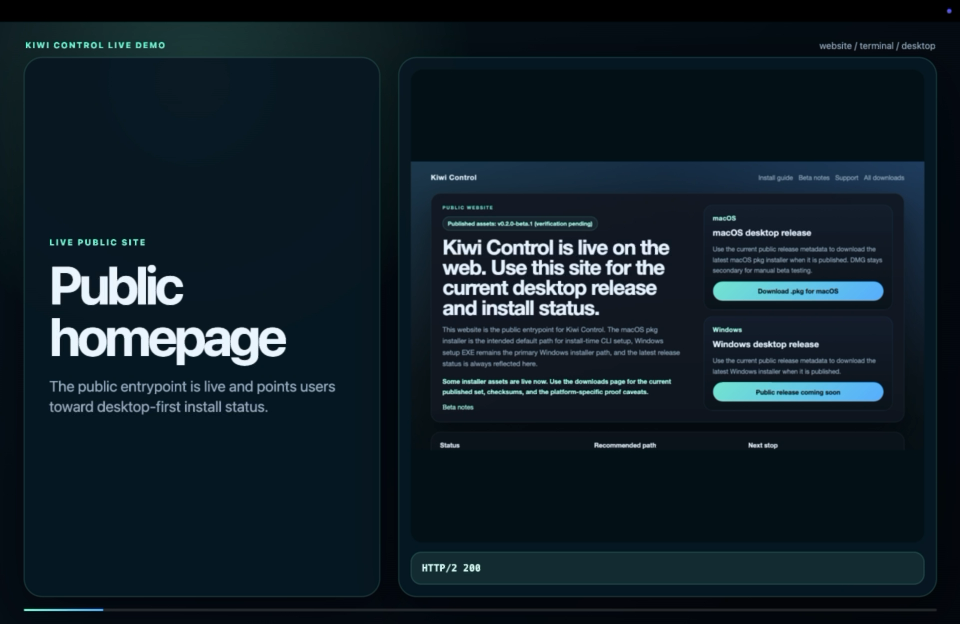

# Kiwi Control

Kiwi Control is a local-first, repo-first control plane for coding agents. It keeps workflow authority inside the repository, exposes a practical CLI for day-to-day work, and ships a Tauri desktop app for visibility, validation, and review.

## Measured proof

Kiwi Control now has one controlled public A/B proof run using the same Markdown Notes Organizer task on the same machine.

Method summary:

- Repo A: Claude Code directly, with no Kiwi workflow help before implementation
- Repo B: Kiwi Control status, guide, graph, pack, and review before implementation
- direct Claude JSON usage data captured for both runs
- one measured run, not a universal benchmark

Headline result from that run:

- `37.3%` lower Claude cost
- `24.3%` fewer Claude turns
- `59.0%` lower Claude wall-clock time

Measured values:

| Metric | Repo A without Kiwi | Repo B with Kiwi |
|---|---:|---:|
| Claude invocations | 3 | 2 |
| Claude turns | 37 | 28 |
| Claude cost (USD) | 1.386074 | 0.869697 |
| Output tokens | 27974 | 10958 |
| Cache read tokens | 1301005 | 1100949 |
| Cache creation tokens | 153617 | 99989 |
| Claude wall-clock seconds | 432 | 177 |

Measured on one controlled greenfield A/B run of the same task using direct Claude JSON usage data. This is useful product proof, not a universal benchmark.

- Demo / Proof page: [kiwi-control.kiwi-ai.in/proof](https://kiwi-control.kiwi-ai.in/proof/)
- Raw proof bundle: [docs/proof/ab-run-2026-04-15](./docs/proof/ab-run-2026-04-15/README.md)

## Demo video

[](./output/demo/2026-04-14-video-final/final/kiwi-control-demo-complete-github.mov)

- Full demo: [kiwi-control-demo-complete-github.mov](./output/demo/2026-04-14-video-final/final/kiwi-control-demo-complete-github.mov)
- Short demo: [kiwi-control-demo-short.mov](./output/demo/2026-04-14-video-final/final/kiwi-control-demo-short.mov)
- Real terminal run: [kiwi-control-terminal-real-run.mov](./output/demo/2026-04-14-video-final/final/kiwi-control-terminal-real-run.mov)

## Quick links

- Website: [kiwi-control.kiwi-ai.in](https://kiwi-control.kiwi-ai.in/)
- Demo / Proof: [kiwi-control.kiwi-ai.in/proof](https://kiwi-control.kiwi-ai.in/proof/)
- Downloads: [kiwi-control.kiwi-ai.in/downloads](https://kiwi-control.kiwi-ai.in/downloads/)
- Install guide: [docs/install.md](./docs/install.md)
- Generated artifact policy: [docs/generated-artifacts.md](./docs/generated-artifacts.md)
- Support: [SUPPORT.md](./SUPPORT.md)
- Security: [SECURITY.md](./SECURITY.md)
- Contributing: [CONTRIBUTING.md](./CONTRIBUTING.md)
- Public docs index: [docs/README.md](./docs/README.md)

## Why Kiwi

Most agent tooling either hides workflow logic in an editor integration or centralizes control behind a cloud service. Kiwi takes the opposite approach:

- the repository remains the source of truth
- repo-local artifacts are explicit and inspectable
- the CLI is the primary operational surface
- the desktop app reflects repo state instead of inventing hidden state
- AWS hosts the public beta website, metadata, and published binaries
- GitHub Releases is optional archival history, not the public install source of truth

## Install

### Desktop-first public beta

For most users, the fastest path is:

1. Download Kiwi Control from the [installer-first website](https://kiwi-control.kiwi-ai.in/) or the public [downloads page](https://kiwi-control.kiwi-ai.in/downloads/).
2. Install the desktop app for macOS or Windows from the public downloads surface.
3. macOS: prefer the beta `.pkg` installer. It is the intended default path for install-time `kc` setup. The `.dmg` remains a secondary manual beta path.
4. Windows: prefer the setup EXE for the desktop path. The MSI is available as a secondary manual path for the current beta.
5. If the current unsigned macOS beta build is blocked by Gatekeeper, use a manual first-open override, then continue testing normally.
6. Choose a repo and initialize it if needed.
7. Keep using the app, or use `kc` too after the platform-specific setup succeeds.

### CLI path

The standalone CLI wrapper installers are the fastest terminal path:

```bash
curl -fsSL https://kiwi-control.kiwi-ai.in/install.sh | bash
```

```powershell
irm https://kiwi-control.kiwi-ai.in/install.ps1 | iex
```

They install `kiwi-control` and `kc` only, then verify `kc --help`. They do not install the desktop app unless a desktop option is explicitly requested and a real artifact exists for that OS. If Kiwi Control Desktop is already installed on the machine, `kc ui` can launch or attach to it.

After install:

```bash
kiwi-control --help
kc status
```

See [docs/install.md](./docs/install.md) for the detailed desktop, CLI wrapper, and contributor paths.

## First repo flow

```bash
cd /path/to/repo
kc init
kc status
kc check
kc guide
```

Continue work:

```bash
kc next
kc validate
kc checkpoint "ready for qa"
kc handoff --to qa-specialist
```

Open the desktop app:

```bash
kc ui
```

## Current public beta shape

- the public AWS-hosted site is the source of truth for installable artifacts and release metadata
- the website is installer-first and release-aware
- macOS `.pkg` is the primary beta installer and `.dmg` is the secondary manual fallback
- Windows setup EXE is the intended primary Windows installer path for the current beta, with MSI available as a secondary manual path
- Windows and macOS are the primary desktop install targets
- Homebrew formula/cask output is scaffolded for a future tap, not published as a live `brew install` path
- signing and notarization status must be checked release by release
- internal package names such as `sj-core`, `sj-cli`, and `sj-ui` remain implementation details

See [docs/beta-limitations.md](./docs/beta-limitations.md) for the current beta limits and trust notes.

## Features

- Repo-local planning, validation, checkpoints, and handoffs
- Context trees, bounded file selection, and execution-plan state
- Machine advisory for toolchain, MCP, and usage health
- Cross-platform desktop shell via Tauri
- CLI-driven workflows for guide, next step, retry, validate, trace, and auto-run

## Repository map

- `packages/sj-core` — repo-local engine, planning, selection, validation, and repo-state aggregation
- `packages/sj-cli` — installable CLI over `sj-core`
- `apps/sj-ui` — Tauri desktop shell
- `configs/`, `prompts/`, `templates/` — canonical product authority
- `.agent/` — generated repo-local state and continuity artifacts

For a deeper architectural view, read [ARCHITECTURE.md](./ARCHITECTURE.md).

## Development

Requirements:

- Node.js 22+
- npm 10+
- Rust/Cargo for desktop builds

Default local verification loop:

```bash
npm install
npm run build
npm test
bash scripts/smoke-test.sh
```

Before committing, restore generated runtime, proof, and preview artifacts that are not intended source changes. See [docs/generated-artifacts.md](./docs/generated-artifacts.md).

Desktop development:

```bash
npm run ui:dev
```

Desktop production build:

```bash
npm run ui:desktop:build
```

If you are on an external macOS volume, run:

```bash
npm run clean:macos-sidecars
```

before or after heavy Git operations if AppleDouble `._*` files start appearing.

## Project goals

Kiwi Control is intentionally:

- repo-first
- local-first
- additive
- non-destructive
- explicit about limits and confidence

It is intentionally not:

- a generic agent runtime replacement
- a hidden automation layer
- a cloud-required control plane
- a destructive “auto-fix everything” tool

## Created by

Kiwi Control is created by Shrey Soni.

- GitHub: https://github.com/sonishrey9
- LinkedIn: https://www.linkedin.com/in/shreykumarsoni/
- Email: sonishrey9@gmail.com

## License

See [LICENSE](./LICENSE).
