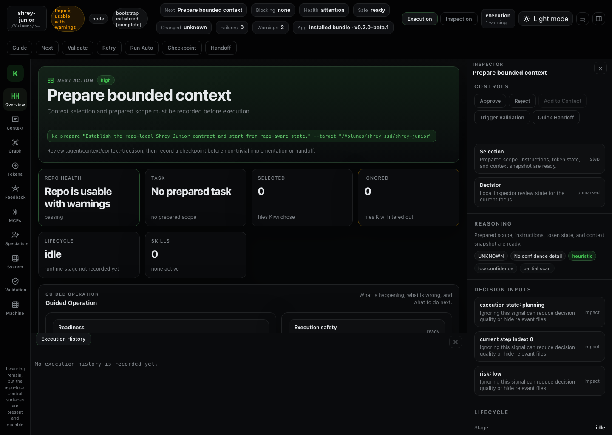
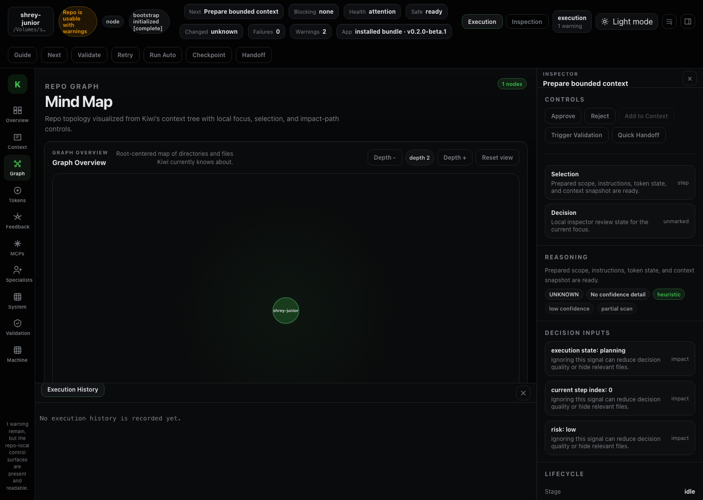

# Kiwi Control

Kiwi Control is a local-first, repo-first control plane for coding agents. It keeps workflow authority inside the repository, exposes a practical CLI for day-to-day work, and ships a Tauri desktop app for visibility, validation, and review.




## Quick links

- Website: [kiwi-control.kiwi-ai.in](https://kiwi-control.kiwi-ai.in/)
- Downloads: [GitHub Releases](https://github.com/sonishrey9/kiwi-control/releases/latest)
- Install guide: [docs/install.md](./docs/install.md)
- Support: [SUPPORT.md](./SUPPORT.md)
- Security: [SECURITY.md](./SECURITY.md)
- Contributing: [CONTRIBUTING.md](./CONTRIBUTING.md)
- Public docs index: [docs/README.md](./docs/README.md)

## Why Kiwi

Most agent tooling either hides workflow logic in an editor integration or centralizes control behind a cloud service. Kiwi takes the opposite approach:

- the repository remains the source of truth
- repo-local artifacts are explicit and inspectable
- the CLI is the primary operational surface
- the desktop app reflects repo state instead of inventing hidden state
- GitHub Releases remains the source of truth for public beta binaries

## Install

### Desktop-first public beta

For most users, the fastest path is:

1. Download Kiwi Control from [GitHub Releases](https://github.com/sonishrey9/kiwi-control/releases/latest) or the [installer-first website](https://kiwi-control.kiwi-ai.in/).
2. Install the desktop app for macOS or Windows.
3. Launch Kiwi Control once.
4. Use onboarding to install `kc`, choose a repo, and initialize it if needed.

### CLI path

The standalone CLI bundle remains available from GitHub Releases.

After install:

```bash
kiwi-control --help
kc status
```

See [docs/install.md](./docs/install.md) for the detailed desktop, CLI, and contributor paths.

## First repo flow

```bash
cd /path/to/repo
kc init
kc status
kc check
kc guide
```

Continue work:

```bash
kc next
kc validate
kc checkpoint "ready for qa"
kc handoff --to qa-specialist
```

Open the desktop app:

```bash
kc ui
```

## Current public beta shape

- GitHub Releases is the source of truth for installable artifacts
- the website is installer-first and release-aware
- Windows and macOS are the primary desktop install targets
- signing and notarization status must be checked release by release
- internal package names such as `sj-core`, `sj-cli`, and `sj-ui` remain implementation details

See [docs/beta-limitations.md](./docs/beta-limitations.md) for the current beta limits and trust notes.

## Features

- Repo-local planning, validation, checkpoints, and handoffs
- Context trees, bounded file selection, and execution-plan state
- Machine advisory for toolchain, MCP, and usage health
- Cross-platform desktop shell via Tauri
- CLI-driven workflows for guide, next step, retry, validate, trace, and auto-run

## Repository map

- `packages/sj-core` — repo-local engine, planning, selection, validation, and repo-state aggregation
- `packages/sj-cli` — installable CLI over `sj-core`
- `apps/sj-ui` — Tauri desktop shell
- `configs/`, `prompts/`, `templates/` — canonical product authority
- `.agent/` — generated repo-local state and continuity artifacts

For a deeper architectural view, read [ARCHITECTURE.md](./ARCHITECTURE.md).

## Development

Requirements:

- Node.js 22+
- npm 10+
- Rust/Cargo for desktop builds

Default local verification loop:

```bash
npm install
npm run build
npm test
bash scripts/smoke-test.sh
```

Desktop development:

```bash
npm run ui:dev
```

Desktop production build:

```bash
npm run ui:desktop:build
```

If you are on an external macOS volume, run:

```bash
npm run clean:macos-sidecars
```

before or after heavy Git operations if AppleDouble `._*` files start appearing.

## Project goals

Kiwi Control is intentionally:

- repo-first
- local-first
- additive
- non-destructive
- explicit about limits and confidence

It is intentionally not:

- a generic agent runtime replacement
- a hidden automation layer
- a cloud-required control plane
- a destructive “auto-fix everything” tool

## Created by

Kiwi Control is created by Shrey Soni.

- GitHub: https://github.com/sonishrey9
- LinkedIn: https://www.linkedin.com/in/shreykumarsoni/
- Email: sonishrey9@gmail.com

## License

See [LICENSE.md](./LICENSE.md).
