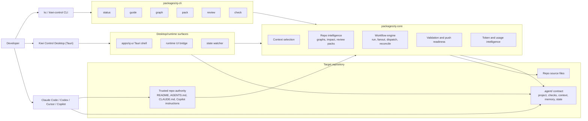
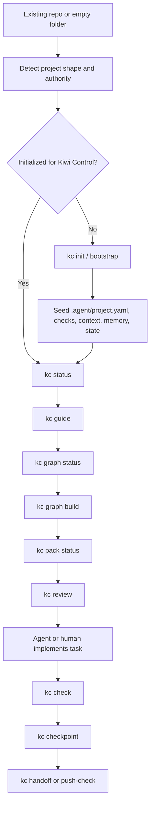
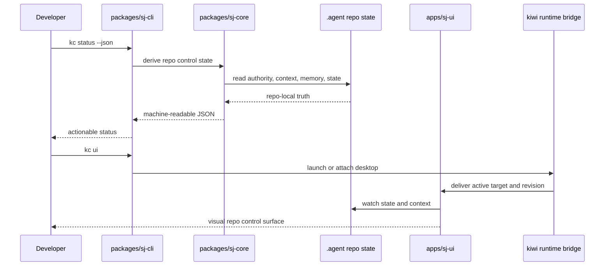
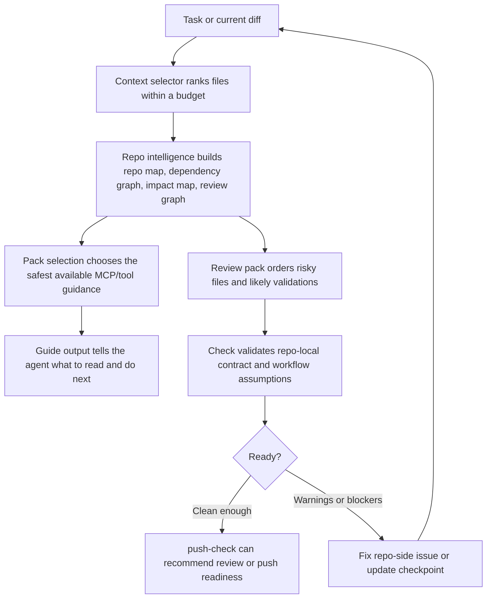
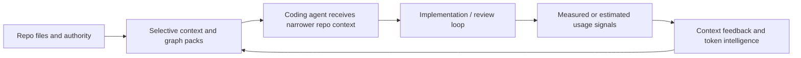

# Kiwi Control Architecture Diagrams

These diagrams describe the current Kiwi Control architecture as implemented in this repository. They are intentionally repo-first: the repository owns the durable contract, the CLI and desktop app read that contract, and outside coding agents use it as structured context.

## High-Level System Flow

## Repo Lifecycle Flow

## CLI To Core To Desktop Interaction

## Review, Check, Pack, And State Decision Flow

## Token-Efficiency Feedback Loop

This loop does not guarantee savings. It is the architecture that makes lower waste plausible: better repo awareness, fewer broad reads, smaller context packs, and review surfaces that point agents at the files most likely to matter.
