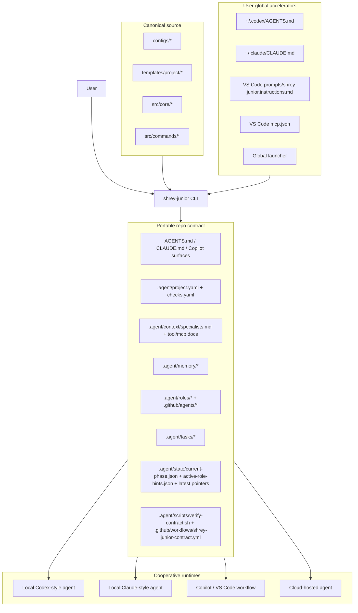
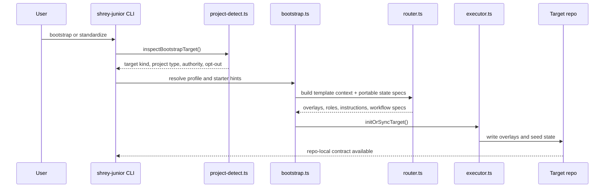
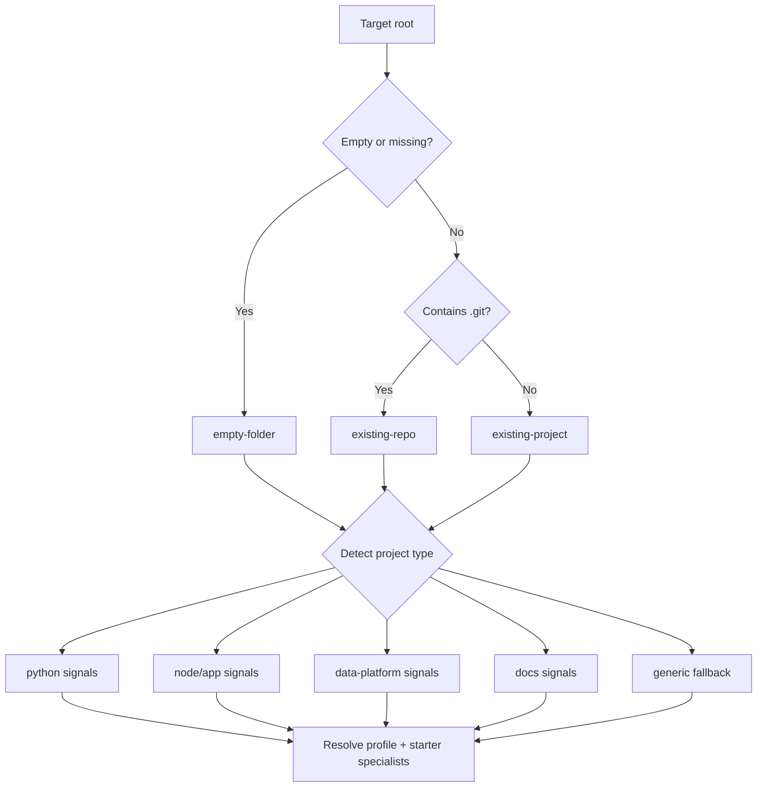
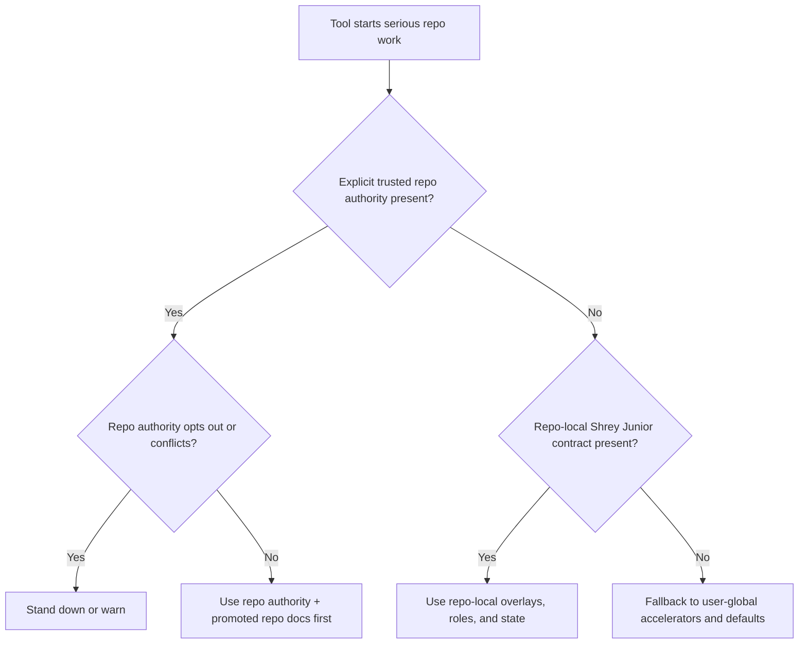
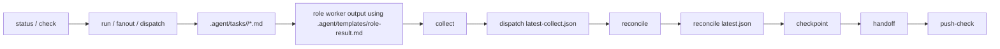
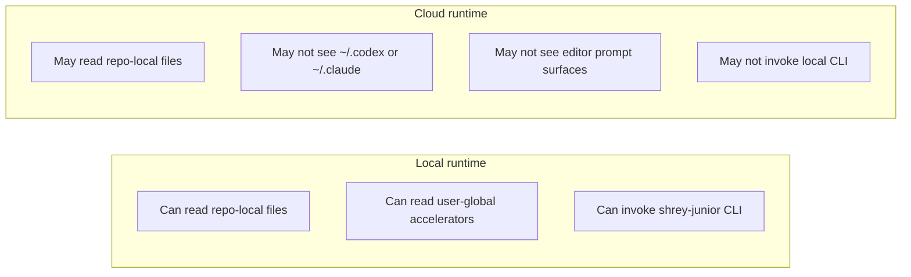
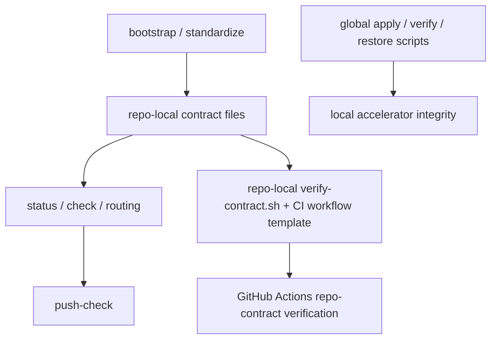
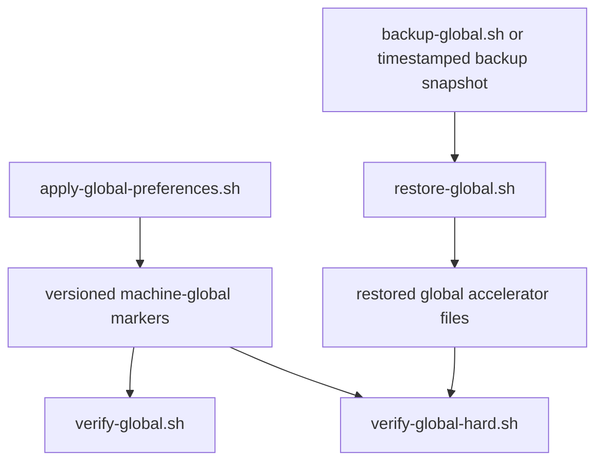

# Technical Architecture

## Executive Summary

Shrey Junior is a repo-aware control plane for coding agents. It is strongest when tools can read repo-local files and continuity artifacts. Machine-global surfaces accelerate local workflows, but the portable contract now lives in the repo itself.

This document distinguishes:

- **Proven**: validated in this environment with code, tests, or verification scripts
- **Structurally supported**: implemented and available, but not fully replay-proven across every target runtime
- **Unproven**: plausible or expected, but not directly validated

## Proven / Supported / Unproven Matrix

| Capability | Status | Notes |
| --- | --- | --- |
| Repo-local contract generation for new repos | Proven | `bootstrap` installs overlays, role specs, state seed, and CI workflow |
| Existing repo upgrade path | Proven | `standardize` wraps the bootstrap planner with backup support |
| Selective contract generation by repo shape | Proven | irrelevant instructions and specialist surfaces are skipped |
| Quiet generic fallback | Proven | generic repos now default to architecture/review/qa/docs instead of fullstack-heavy starter noise |
| Repo-authority stand-down | Proven | explicit repo-local opt-out remains stronger than generated overlays |
| Latest continuity pointer files | Proven | handoff, dispatch, reconcile, and latest packet pointers are written/read locally |
| Active role hints | Proven | `active-role-hints.json` is seeded and updated by runtime commands |
| Command and capability discovery docs | Proven | repo-local command, tool-capability, and MCP-capability docs are generated into every initialized repo |
| Shared memory bank | Proven | repo-local memory files now seed durable facts, current focus, and low-noise risk carry-forward |
| Curated specialist registry | Proven | `.agent/context/specialists.md` defines the portable specialist vocabulary without forcing every role file into every repo |
| Handoff-native continuity | Proven | handoff v2 records next file, next command, evidence, checkpoint pointer, and recommended MCP pack |
| Curated MCP pack guidance | Proven | repo-local MCP docs now describe packs as routing guidance rather than fake universal tool access |
| Git-aware checkpoints | Proven | bootstrap seeds a checkpoint and `checkpoint` records git-aware continuity even before the first commit |
| First-read contract across repo-local and machine-global surfaces | Proven | templates and global accelerators now point tools at the same repo-local read order |
| Global preference layers with rollback and idempotency | Proven | verified by global verification scripts |
| Copilot-native repo-local surfaces | Proven locally / structurally supported in tooling | files are generated and validated; honoring by every runtime is not proven |
| Claude-style specialist role specs | Proven locally / structurally supported in tooling | files are generated and referenced by packets; universal native role loading is unproven |
| Cloud-hosted agents seeing machine-global files | Unproven | not portable by design |
| Universal runtime enforcement of repo rules | Unproven | CI is the hard backstop instead |

## Component Inventory

### User-global acceleration surfaces

- `~/.codex/AGENTS.md`
- `~/.codex/config.toml`
- `~/.claude/CLAUDE.md`
- `~/.claude/settings.json`
- `~/.claude/commands/shrey-read-first.md`
- `~/.claude/commands/shrey-serious-task.md`
- `VS Code prompts/shrey-junior.instructions.md`
- `VS Code mcp.json`
- global `shrey-junior` launcher

### Repo-local contract surfaces

- `AGENTS.md`
- `CLAUDE.md`
- `.github/copilot-instructions.md`
- `.github/instructions/*.instructions.md`
- `.github/agents/*.md`
- `.agent/project.yaml`
- `.agent/checks.yaml`
- `.agent/context/*`
- `.agent/memory/*`
- `.agent/roles/*.md`
- `.agent/templates/role-result.md`
- `.agent/scripts/verify-contract.sh`
- `.agent/tasks/*`
- `.agent/state/*`
- `.github/workflows/shrey-junior-contract.yml`

### Core implementation components

- `src/core/project-detect.ts`
- `src/core/bootstrap.ts`
- `src/core/router.ts`
- `src/core/context.ts`
- `src/core/state.ts`
- `src/core/dispatch.ts`
- `src/core/reconcile.ts`
- `src/core/packets.ts`
- `src/core/validator.ts`
- `src/commands/status.ts`
- `src/commands/standardize.ts`
- `scripts/apply-global-preferences.sh`
- `scripts/verify-global.sh`
- `scripts/verify-global-hard.sh`
- `scripts/restore-global.sh`

## High-Level Architecture

## Initialization Flow

## Runtime Communication Flow

1. `status` compiles authority, continuity, and current routing state.
2. `run`, `fanout`, or `dispatch` produce task packets and refresh active-role hints.
3. active-role-hints refreshes `current-focus.json`.
4. `checkpoint` records the latest git-aware continuity summary.
5. role workers write results against the packet and role-result contract.
6. `collect` reads dispatch outputs.
7. `reconcile` writes the conflict and agreement summary and updates next-step routing.
8. `handoff` persists cross-tool continuity with evidence and next-command guidance.
9. `push-check` evaluates readiness using git state and latest reconcile state.

The practical first read for any cooperative runtime is:

1. trusted repo authority
2. `active-role-hints.json`
3. `current-phase.json`
4. `checkpoints/latest.json`
5. latest packet, handoff, dispatch, and reconcile pointers
6. `commands.md`, `tool-capabilities.md`, and `mcp-capabilities.md`
7. path-specific instructions
8. checks and repo-local verifier expectations

## Repo Detection And Routing Flow

`project-detect.ts` performs shallow metadata-based classification. It intentionally prefers safe top-level signals over deep crawling.

## Repo-Authority Precedence

Repo-local opt-out remains stronger than generated Shrey Junior overlays.

## Contract Minimization

The portable contract is no longer maximal by default.

- universal core surfaces are installed in every repo
- instruction surfaces are chosen by project type and starter specialist set
- role specs and agent docs are generated for relevant specialists only
- skipped surfaces are recorded in `.agent/project.yaml`

See [contract-minimization.md](/Volumes/shrey%20ssd/shrey-junior/docs/contract-minimization.md).

## Task Packet Lifecycle

## Artifact Contract Table

See [artifact-contracts.md](/Volumes/shrey%20ssd/shrey-junior/docs/artifact-contracts.md) for the canonical table.
See [checkpointing.md](/Volumes/shrey%20ssd/shrey-junior/docs/checkpointing.md) for the git-aware continuity layer.

## Local Vs Cloud Visibility Model

Cursor-like tools are treated as part of the second model unless they are explicitly configured locally. Compatibility comes from the repo-local contract, not from assuming a proprietary local config format.

## Enforcement And Verification Flow

## Verification And Rollback Flow

## Failure Modes And Limitations

- Cloud-hosted agents may not see machine-global files.
- Copilot is suggestion-oriented and less controllable than an explicit orchestration runtime.
- Local CLI invocation is not guaranteed in hosted environments.
- Repo-local artifacts are the most portable contract, not a guarantee of runtime obedience.
- CI is the hard backstop where prompts are not enough.
- Detection is intentionally shallow and may stay conservative for ambiguous repos.

## Recommended Live Validation Tests

1. Replay the same serious task in local Codex, Claude, and Copilot workflows against a standardized repo.
2. Verify a cloud-only repo checkout still allows orientation through repo-local contract files alone.
3. Validate that a repo-local conflict file causes stand-down in a hosted environment, not just locally.
4. Exercise a full `dispatch -> collect -> reconcile -> checkpoint -> handoff -> push-check` loop in a repo with actual role outputs.
